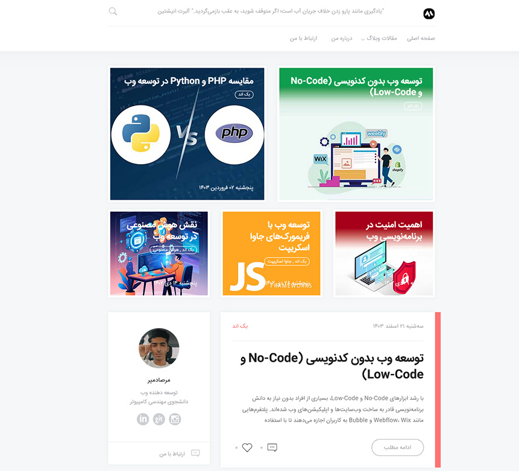

# 📝 ByteBlog

A simple and extensible blog application built with Django.  
This project allows users to create, read, update, and delete blog posts. It also supports comments and categories.

## 📂 Features

- Create, edit, and delete blog posts
- Comment system
- Categories for organizing posts
- Responsive design
- Django Admin panel for managing content

## 🚀 Getting Started

### Prerequisites

- Python 3.9+
- Django 5.0.1+
- Virtualenv (recommended)

### Installation

1️⃣ **Clone the repository**

\`\`\`bash
git clone https://github.com/mersad29/ByteBlog.git
cd ByteBlog
\`\`\`

2️⃣ **Create and activate a virtual environment**

\`\`\`bash
python -m venv venv
source venv/bin/activate  # On Windows use: venv\Scripts\activate
\`\`\`

3️⃣ **Install dependencies**

\`\`\`bash
pip install -r requirements.txt
\`\`\`

4️⃣ **Apply migrations**

\`\`\`bash
python manage.py migrate
\`\`\`

5️⃣ **Create a superuser**

\`\`\`bash
python manage.py createsuperuser
\`\`\`

6️⃣ **Run the development server**

\`\`\`bash
python manage.py runserver
\`\`\`

Then open [http://127.0.0.1:8000/](http://127.0.0.1:8000/) in your browser.

## ⚙️ Project Structure

\`\`\`
ByteBlog/
├── Account/         
├── Article/     
├── assets/       
├── ByteBlog/   
├── context_processors/      
├── Index/          
├── media/
├── staticfiles/
├── templates/           
├── manage.py
├── requirements.txt
└── README.md
\`\`\`

## 🛠️ Usage

- Visit /admin/ to manage posts, categories, and users.
- Posts can be categorized and commented on by Admin.

## 📧 Contact

Made by [Mersad29](https://github.com/Mersad29)